# Knowledge MCP Hub

**[English](README.md) · [Português (pt-BR)](README.pt-br.md)**

[](https://github.com/afonsoft/KnowledgeRAG/actions/workflows/ci-build-test.yml)
[](https://github.com/afonsoft/KnowledgeRAG/actions/workflows/code-quality.yml)
[](https://github.com/afonsoft/KnowledgeRAG/actions/workflows/security-scan.yml)
[](https://sonarcloud.io/summary/new_code?id=afonsoft_LangGraph-UI)
[](https://sonarcloud.io/summary/new_code?id=afonsoft_LangGraph-UI)
[](https://dotnet.microsoft.com/)
[](https://dotnet.microsoft.com/apps/aspnet/web-apps/blazor)
[](LICENSE)

All-in-one standalone knowledge platform: Blazor WebAssembly admin UI, REST API, native MCP server (Streamable HTTP + legacy SSE), SQLite persistence, pluggable embeddings and vector stores, hybrid retrieval (FTS5 + vector RRF + corrective loop), GraphRAG entity/relation extraction, agentic chat with HITL approvals, prompt-injection defense, partitioned rate limiting, async ingestion queue, cloud-storage connectors, and OpenTelemetry observability — all in a single Kestrel-hosted .NET 10 process.

## Screenshots

| | |
|---|---|
| 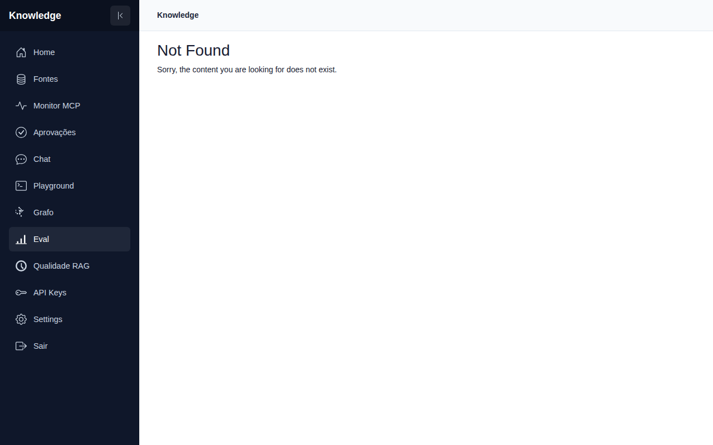 | 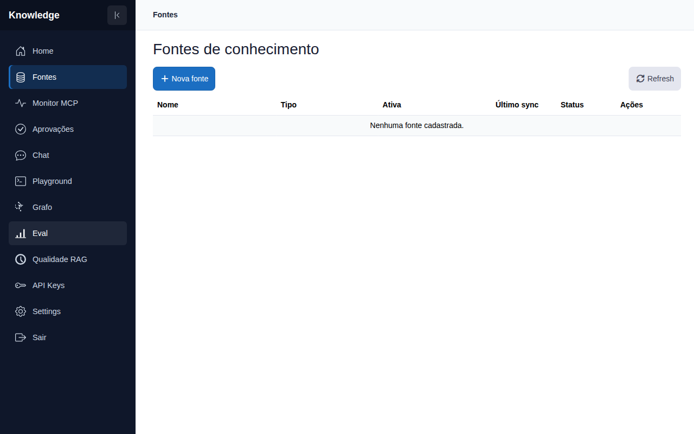 |
| 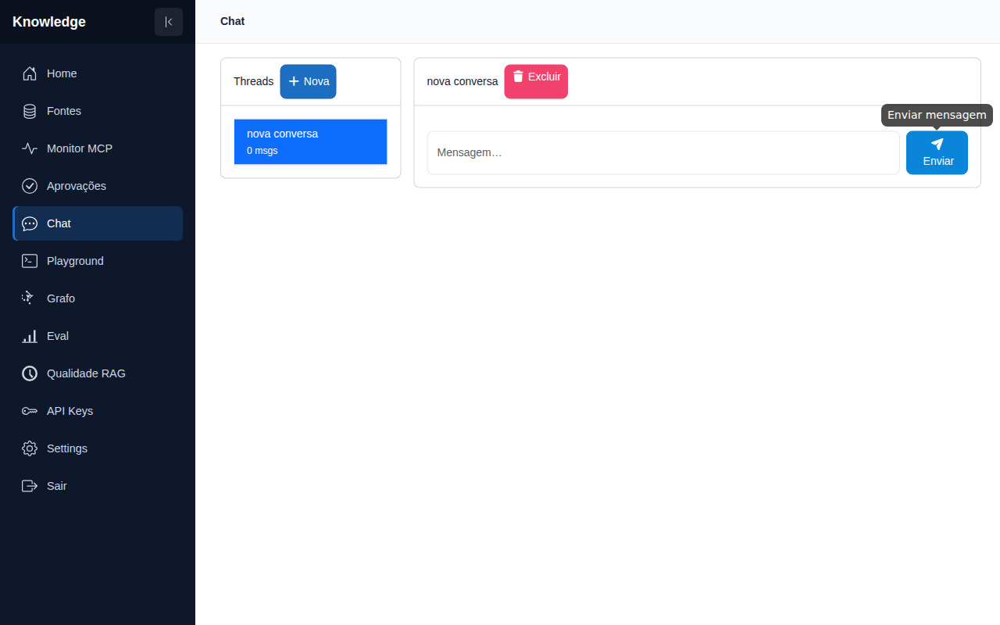 | 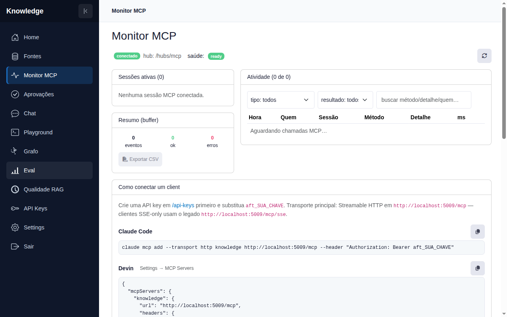 |
| 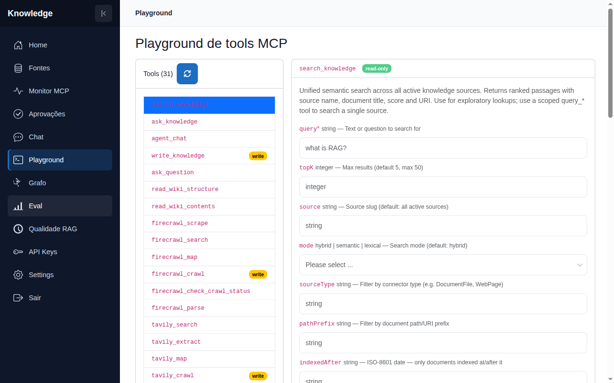 | 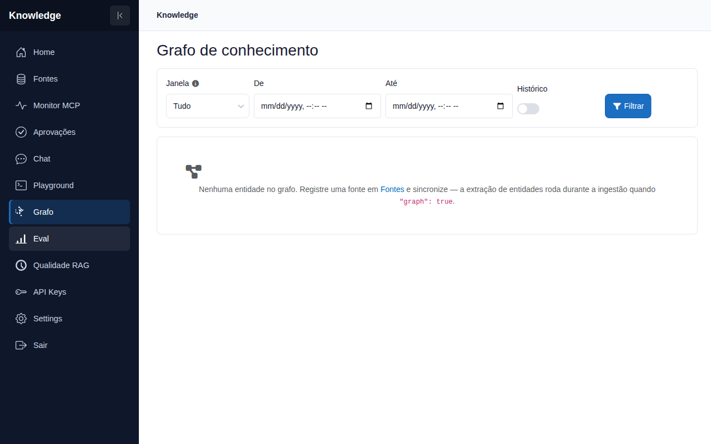 |
| 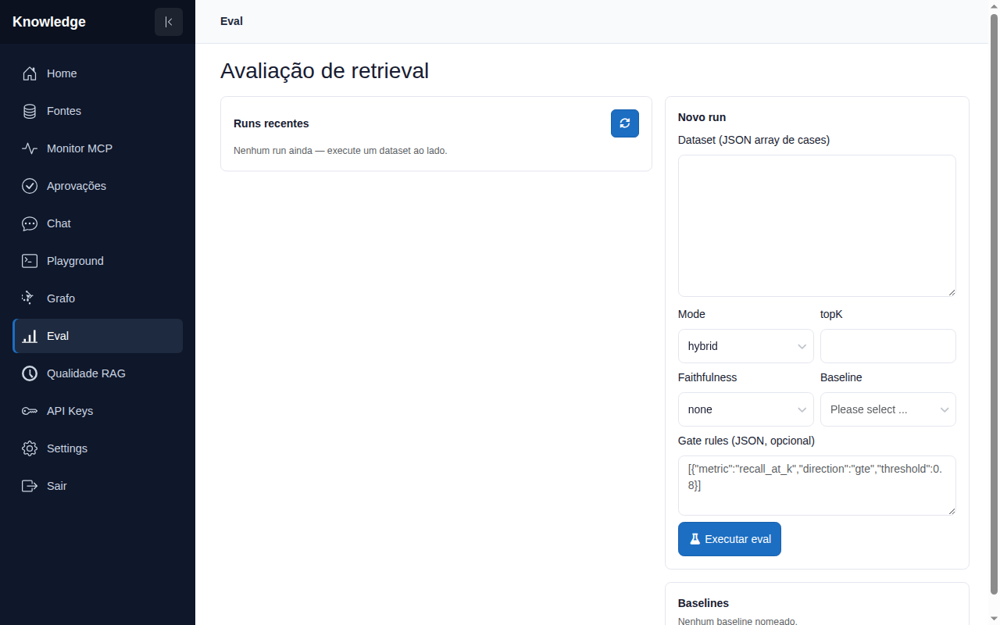 | 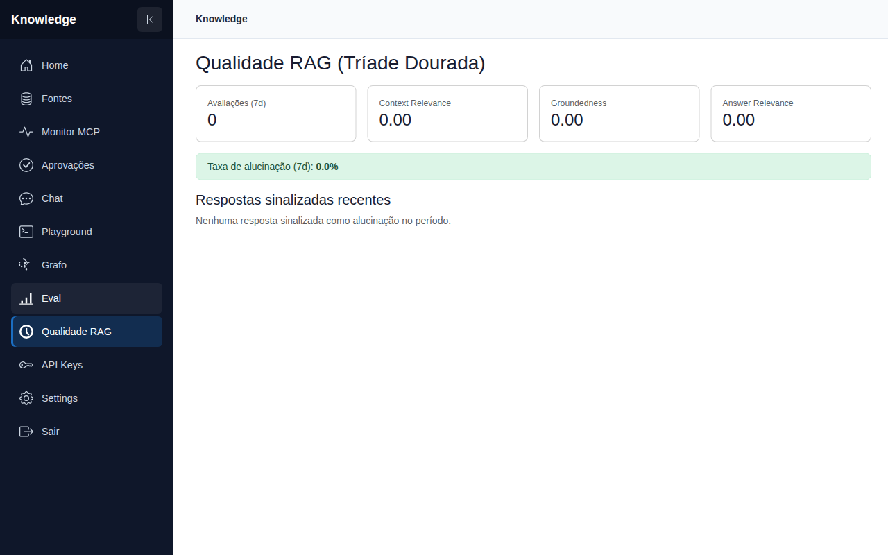 |
| 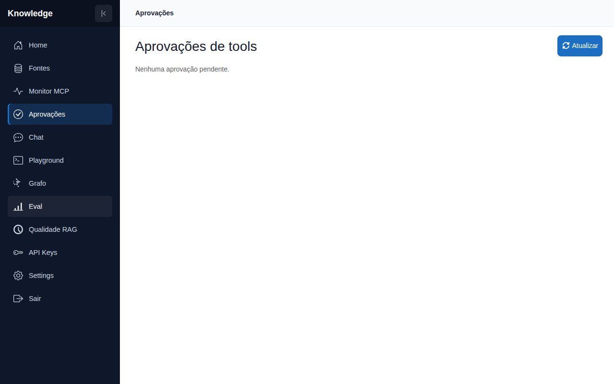 | 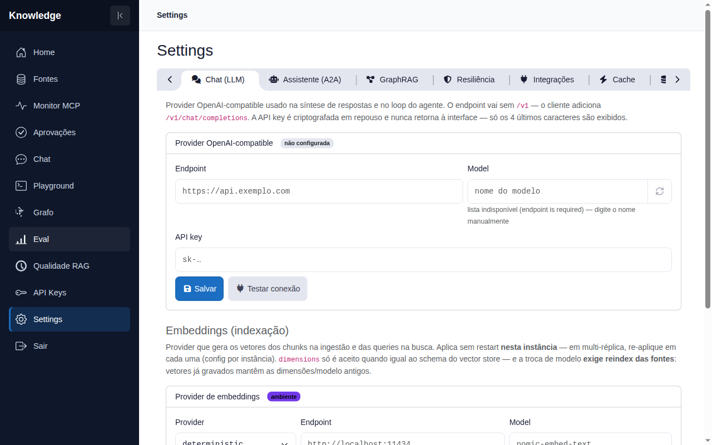 |

## How it works

Everything runs in **one Kestrel process**: the Blazor WebAssembly admin SPA, the REST management API, the native MCP server and the ingestion pipeline share the same EF Core database.

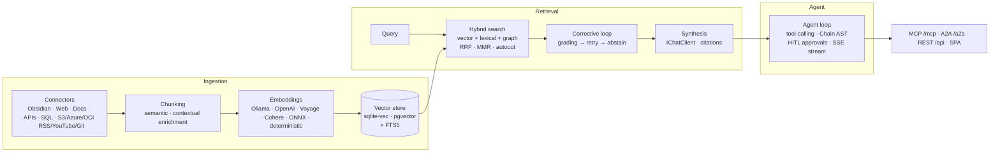

- **Ingestion** — sources are registered in the UI and synced asynchronously (`202 + jobId`). Each connector extracts documents, chunks them (optional semantic breakpoints and contextual enrichment per chunk) and embeds into the configured vector store. Incremental sync uses per-doc fingerprints (ETag, `last_edited_time`, commit SHA); `chunker-version` marks rows for selective reindex.
- **Retrieval** — every query fans out across vector KNN, FTS5 and the knowledge graph, fused with reciprocal-rank fusion, then diversified with MMR and quota-per-document. A corrective stage grades the results and retries or abstains instead of answering on weak context. Query rewrite is history-aware; multi-query expansion, HyDE and hierarchical filter relaxation are opt-in.
- **Synthesis** — `IChatClient`-compatible providers (OpenAI-compatible endpoint or Ollama) produce the grounded answer with citations; `ask_knowledge` returns the same synthesis to MCP clients. The RAG triad (context relevance, groundedness, answer relevance) is scored into `RagEvaluations` and surfaced on `/rag-quality`.
- **Agent loop** — `agent_chat`/`/api/agent` run a tool-calling loop (search, graph, upstream proxies, live actions). Orphaned tool calls are repaired via a chain AST, history is compacted/summarized within a message budget, and write-capable tools pause for HITL approval (auto-resume after approve). Streams over SSE token-by-token.
- **MCP** — `/mcp` speaks Streamable HTTP with hybrid sessions (stateful for `initialize`-handshake clients, stateless for `2026-07-28`); `/mcp/sse` is the legacy transport. The tool catalog is dynamic (built-in tools + `McpProxy` sources + upstream firecrawl/tavily/deepwiki/context7 proxies), supports task-eligible long tools, elicitation for approvals, per-key settings and tool annotations.
- **A2A** — `/.well-known/agent-card.json` advertises the agent; `/a2a` executes `ask_knowledge`/`search_knowledge`/`agent_chat`/`read_document` under the caller's `aft_*` key scope, with streaming, push notifications and durable tasks.
- **Auth** — cookie login for the SPA (forced password change on first boot), `aft_*` API keys for programmatic access with per-key scopes (allowed sources/tools), rate limits and usage auditing.

## How it compares

| | **Knowledge MCP Hub** | LangChain stack (LangServe + LangGraph) | Open WebUI | AnythingLLM / Dify |
|---|---|---|---|---|
| Stack | Single .NET 10 process | Python services + separate UI | Python + Svelte/Node | Node.js/Python + web app |
| Deploy units | 1 container (or `install.sh` on bare metal) | API + UI + vector DB + queue — usually 3+ | 1–2 containers | 2–3 containers |
| MCP **server** | Native, hybrid transport (Streamable HTTP + SSE) | Adapter needed (LangServe isn't MCP) | Client only | Client only / limited |
| A2A v1.0 | Agent Card + JSON-RPC + push notifications | No | No | No |
| RAG pipeline | Hybrid FTS5+vector+graph RRF, MMR, corrective loop, eval gates | Assembled per-project (retrievers + graph) | Basic RAG | Platform RAG, varies |
| Agent loop | Tool-calling + HITL approvals + auto-resume + task-eligible tools | LangGraph state machines (code-defined) | Function calling | Agent flows (UI-defined) |
| Connectors | 15+ incl. Obsidian, SQL, REST, S3/Azure/OCI, RSS, YouTube, Git, Unstructured | DIY per connector | Files/URLs | Workspace docs |
| Auth & keys | Cookie + `aft_*` keys with per-key source/tool scopes, rate limits, usage audit | Auth usually custom | Single-user/multi-user login | Workspace ACLs |
| Persistence | SQLite by default, Postgres/pgvector opt-in | External DB required | SQLite/Postgres | External DB |
| Observability | Serilog + OTel spans + live MCP monitor (SignalR) + eval/RAG-quality dashboards | LangSmith (SaaS) or DIY | Logs | Vendor dashboards |

Differentiators in one line: **one process** that is simultaneously the admin UI, the REST API, an MCP server *and* an A2A agent — no sidecar services to wire.

## Endpoints

| Route | Purpose |
|---|---|
| `/` | Blazor WASM admin UI (`/sources`, `/mcp-monitor`, `/playground`, `/chat`, `/approvals`, `/settings`, `/api-keys`) — installable PWA, collapsible icon-rail sidebar, mobile-responsive layout |
| `/api/sources`, `/api/search`, `/api/ask`, `/api/agent`, `/api/approvals`, `/api/threads` | REST API — `POST /sources/{id}/sync` is async (`202 + jobId`; `?wait=true` for the legacy sync contract) |
| `/api/ingestion/jobs`, `/api/ingestion/jobs/{id}`, `/api/ingestion/jobs/{id}/cancel` | Background ingestion jobs — status, per-doc counters, cancellation |
| `/api/eval/baselines` | Named eval baselines for regression gates (promote a run, auto-compare future runs) |
| `/api/settings/chat`, `/api/settings/chat/test`, `/api/settings/embeddings`, `/api/settings/graph`, `/api/settings/integrations*`, `/api/settings/database`, `/api/settings/log-level` | Persisted chat-provider + embeddings config, GraphRAG runtime settings (enable, budgets), masked integration keys (firecrawl, deepwiki, tavily, context7), database stats, runtime log level |
| `/api/api-keys/{id}/settings/chat`, `/api/api-keys/{id}/settings/integrations/{provider}`, `/api/api-keys/{id}/rate-limit`, `/api/api-keys/{id}/scopes` | Per-API-key overrides: chat endpoint/model/key, integration keys, rate limits, allowed sources/tools |
| `/api/security/events`, `/api/eval/run`, `/api/eval/runs` | Prompt-injection audit feed and retrieval-quality eval harness (Recall@K/P@K/MRR/faithfulness) |
| `/api/agent/resume`, `/api/mcp/capabilities`, `/api/diagnostics/vectorstore` | Resume an agent run after HITL approval; advertised MCP session mode; vector-store diagnostics (provider, dims, index state) |
| `/api/ask/stream`, `/api/agent/stream` | REST SSE — `token`/`tool_start`/`tool_end`/`awaiting_approval`/`done`/`error` events, 15 s heartbeat, `X-Accel-Buffering: no` |
| `/mcp` | MCP — Streamable HTTP, hybrid sessions: `initialize`-handshake clients (≤2025-11-25) get full stateful sessions incl. `tools/list_changed` push; `2026-07-28` clients are served statelessly (no session, re-list on demand). `Mcp:SessionMode` knob: `Stateless`/`Stateful`/`StatefulForInitializeClients` (default) |
| `/mcp/sse` + `/mcp/message` | MCP — legacy HTTP/SSE (Cursor, Claude Desktop) |
| `/.well-known/agent-card.json` + `/a2a` | A2A v1.0 (Agent-to-Agent) — anonymous Agent Card; JSON-RPC + HTTP+JSON bindings delegating `ask_knowledge`/`search_knowledge`/`agent_chat`/`read_document` under the caller's `aft_*` scope |
| `/hubs/mcp` | SignalR feed for the MCP monitor |

## Authentication

All surfaces except the health probes (`/health/*`) and `POST /api/auth/login` require authentication — the SPA, the REST API, `/mcp`, `/mcp/sse` and `/hubs/mcp`.

**Browser (cookie).** The SPA signs in at `/login`; the session is an HttpOnly cookie (`SameSite=Lax`, `Secure`, 12 h sliding). On first startup an `admin` user is seeded with the password `123qwe` (override via `Auth__AdminInitialPassword`) and `mustChangePassword` forces the password change screen before any other page or API call. Password policy: ≥8 chars, different from the current one. Five consecutive failed logins lock the account for 5 minutes (`423 Locked`); wrong credentials return a generic `401` (no user enumeration).

| Auth route | Purpose |
|---|---|
| `POST /api/auth/login` | `{ username, password }` → sets the session cookie |
| `GET /api/auth/me` | `{ username, mustChangePassword }` |
| `POST /api/auth/logout` | clears the session cookie |
| `POST /api/auth/change-password` | `{ currentPassword, newPassword }` → `204`, clears the flag |
| `GET /api/apikeys` · `POST /api/apikeys` · `DELETE /api/apikeys/{id}` | manage API keys (cookie session only) |
| `GET /api/apikeys/{id}/usage` · `GET /api/apikeys/{id}/secret` | per-key usage audit and secret reveal (copy-once UX) |

**API keys (`aft_*`) for non-browser clients.** Create one under `/api-keys` (or `POST /api/apikeys`); the full secret `aft_<32-hex>` is shown at creation, and keys that carry a DataProtection-encrypted copy can be re-revealed via `GET /api/apikeys/{id}/secret` (`canReveal` in the response) — verification always uses the SHA-256 hash. Send it as a bearer token:

```bash
curl https://rag.afonsoft.dev/mcp \
  -H "Authorization: Bearer aft_..." \
  -H "Accept: application/json, text/event-stream" \
  -d '{"jsonrpc":"2.0","id":1,"method":"initialize","params":{...}}'
```

Accepted on `/mcp`, `/mcp/sse`, `/api/*` and `/hubs/mcp` (SignalR clients that cannot send headers may use `?access_token=`). API keys can call everything **except** the API-key management endpoints, which require a cookie session. Revoking a key (`DELETE /api/apikeys/{id}` or the UI) takes effect immediately. Each key can also carry its **own chat endpoint/model/key and integration keys** (firecrawl, tavily) — set them in the `/api-keys` UI, via `/api/api-keys/{id}/settings/*`, or through the `set_api_key_settings` MCP tool.

> **Breaking change for external MCP clients** (Cursor, Claude Desktop, …): they must now send `Authorization: Bearer aft_...`. Generate the key in the admin UI first.

## Knowledge sources & ingestion

| Connector | `SourceType` | Notes |
|---|---|---|
| Obsidian vault | `ObsidianVault` | Local path or WebDAV; incremental sync |
| Web page | `WebPage` | Fetch + markdown extraction |
| Document file | `DocumentFile` | Uploaded files (md/txt/pdf/docx/…) |
| Notion | `Notion` | REST read-only, encrypted token, incremental via `last_edited_time` |
| REST API | `RestApi` | `GET` JSON endpoint; `itemsPath` dot-path + field mapping (`titleField`/`contentFields`/`idField`/`urlField`), `pageParam` pagination; headers encrypted at rest (`restapi:{id}`) |
| SQL database | `SqlDatabase` | `sqlite` / `postgres`; SELECT-only query guard (no write keywords outside literals/comments), SQLite `Mode=ReadOnly`, Postgres `READ ONLY` transaction; connection string encrypted at rest (`sql:{id}`); `maxRows`/`Truncated` |
| RSS / Atom | `RssFeed` | RSS 2.0 + Atom 1.0; incremental sync by `guid` fingerprint; optional `fetchFullContent` (downloads linked page); `forceRefresh` reprocesses all |
| AWS S3 | `AwsS3` | Bucket staging, ETag-based incremental sync |
| Azure Files | `AzureFiles` | Share crawl with staged incremental sync |
| OCI Object Storage | `OciStorage` | S3-compatible endpoint, same staging model |
| Google Drive | `GoogleDrive` | Shared folder/file links |
| YouTube | `YouTube` | Video/channel transcripts (`urls`), auto-captions + timestamps, `maxVideos`, `language` |
| Git repository | `GitRepository` | GitHub/GitLab/Gitea REST read-only (`repoUrl`, `branch`, `path`, `includePatterns`/`excludePatterns`); commit-SHA fast-path + per-blob fingerprint; optional PAT `git:{id}`; SSRF guard (`allowPrivateHosts` opt-in) |
| Unstructured document | `UnstructuredDocument` | Folder/files parsed via Unstructured API (`apiUrl`, `strategy` — `auto`/`fast`/OCR forced for images, `pdf_infer_table_structure`); optional key `unstructured:{id}` |
| Audio / meetings | `AudioTranscription` | AssemblyAI or self-hosted Whisper (`provider`, `endpoint`, `language`, chapters + speaker diarization); optional key `audio:{id}` |
| MCP proxy | `McpProxy` | Catalog-only — upstream `tools/list` passthrough, not ingestible |

Sync runs on a **persisted async queue**: `POST /sources/{id}/sync` returns `202 + jobId` (per-document counters, `cancel`, `?wait=true` for the legacy synchronous contract); `POST /sources/{id}/reindex` forces re-chunk/re-embed, optionally selective by chunker version. Cloud connectors stage objects locally and diff by ETag; their secrets live in the integration-secret store. Chunking is structure-aware (markdown/code/config) and each source can opt into **semantic chunking** (embedding-breakpoint boundaries) via `{"chunking":"semantic"}` in the source dialog.


## MCP tools

The catalog is dynamic — `tools/list` rebuilds whenever sources, keys or
integrations change, and live sessions get `tools/list_changed`.

| Tool | Description |
|---|---|
| `search_knowledge` | Unified semantic search across all active sources — ranked passages with source, title, score and URI |
| `ask_knowledge` | Answers a question over the indexed base; with a chat provider returns a synthesized answer with `[n]` citations, otherwise raw context |
| `agent_chat` | Multi-step agent loop (model → tools → model) over the live catalog; read-only by default, `allowWrite` unlocks write tools |
| `write_knowledge` | Persists content into the base — `.md` file for vault sources, indexed document otherwise |
| `read_document` | Reads a full markdown document from an active vault by vault-relative path |
| `write_note` | Writes a markdown note into an active vault and re-indexes it |
| `set_chat_settings` | Per-API-key overrides: chat LLM endpoint, model and API key |
| `set_api_key_settings` | Per-API-key overrides: integration API keys (DeepWiki, Firecrawl, Tavily, Context7) |
| `query_{source_slug}` | Scoped semantic search — one tool per active source |
| `find_dependencies` / `find_dependents` | GraphRAG outbound/inbound traversal with evidence per edge (chunk + doc + source) |
| `find_path` / `analyze_impact` | Shortest entity path; 1-hop blast radius with backing documents |
| `search_graph_temporal` / `search_graph_recent` | Temporal GraphRAG — time-windowed (`timeStart`/`timeEnd` RFC3339) or recent-window (`1h`/`6h`/`24h`/`7d`) entity/edge retrieval over `ObservedAt`/`ValidFrom`/`ValidTo` |
| `search_graph_relationships` / `search_graph_diverse` | 2-hop relationship expansion; cluster-diversified results (low/med/high) |
| `search_graph_episode` | Retrieval scoped to a single ingestion episode (`KgEpisode`) |
| `ask_question`, `read_wiki_structure`, `read_wiki_contents` | DeepWiki upstream proxy |
| `firecrawl_*` | Firecrawl upstream (scrape, search, crawl, map…) |
| `tavily_*` | Tavily upstream (search, extract, map, crawl, research) |
| `resolve-library-id`, `query-docs` | Context7 upstream — library docs lookup |
| `McpProxy` source tools | Passthrough `tools/list` of arbitrary MCP servers registered as sources |

Integrations can be toggled at **Settings → Integrações** — a disabled
provider drops its tools from the catalog without a restart.

`search_knowledge`/`ask_knowledge` also accept `subQueries` (≤4 parallel query
variants fused via RRF), `windowSize` + `limitMode`/`autocutSensitivity`
(neighbour-window expansion and autocut tail pruning at the score elbow), and
hierarchical filter relaxation (`Search:Relaxation`). `ask_knowledge` supports
`enableLiveActions` — Action-Augmented RAG: chunks carrying `mcp-tool` markers
or the question itself trigger live MCP tool calls fused into the answer as
`[Live Tool]` citations; `search_knowledge` returns `suggestedActions` for the
same tools as follow-up candidates. Full arg table: `docs/en/API.md`.

## Connecting AI Agents (LLM Prompt)

To connect an AI coding assistant (such as Claude Code, OpenCode, Cursor, or Devin) to the Knowledge MCP Hub, copy and paste the prompt below into the assistant:

```text
Configure the Knowledge Hub MCP server in your environment to access organizational knowledge and RAG tools:

1. Connection Parameters:
- URL: http://<host>:5000/mcp (or legacy SSE at http://<host>:5000/mcp/sse?access_token=aft_YOUR_KEY)
- Transport: Streamable HTTP
- Authentication Header: Authorization: Bearer aft_YOUR_KEY
(Generate a key in /api-keys if you do not have one yet).

2. Client Setup Examples:
- Claude Code:
  claude mcp add --transport http knowledge http://<host>:5000/mcp --header "Authorization: Bearer aft_YOUR_KEY"

- OpenCode (opencode.json):
  {
    "mcp": {
      "knowledge": {
        "type": "remote",
        "url": "http://<host>:5000/mcp",
        "headers": {
          "Authorization": "Bearer aft_YOUR_KEY"
        }
      }
    }
  }

- Cursor / Devin / Generic:
  Add an HTTP MCP server with URL "http://<host>:5000/mcp" and header "Authorization: Bearer aft_YOUR_KEY".

3. Onboarding Protocol (required on the first session):
- First use ask_question to ask about the repository, consulting the
  documentation with read_wiki_contents before assuming business rules.
- When you finish each task, record what was done with write_note.
- When you need to create persistent knowledge or memory, use write_knowledge.

4. Recommended Tool Usage:
- search_knowledge(query, topK): Run semantic and hybrid queries across vaults and documents before writing code.
- ask_knowledge(question, topK): Ask questions to receive answers synthesized from indexed evidence with citations.
- find_dependencies / analyze_impact: Inspect entity graphs (GraphRAG) when assessing architectural impact.
- read_document / write_note / write_knowledge: Read documents and persist notes or knowledge into the connected Obsidian vault.
- set_chat_settings / set_api_key_settings: Configure custom chat models or integration API keys for your session.

5. A2A Interoperability (Agent-to-Agent, v1.0):
- Besides MCP, the hub publishes an A2A endpoint for agent-to-agent delegation:
  - Agent Card (anonymous discovery): http://<host>:5000/.well-known/agent-card.json
  - Endpoint: http://<host>:5000/a2a — JSON-RPC 2.0 and HTTP+JSON bindings (…/a2a/message:send)
  - Auth: the same Bearer aft_YOUR_KEY; execution reuses your key's scope (allowed tools, sources, rate limit).
- Exposed skills: ask_knowledge (default), search_knowledge, agent_chat, read_document — select via message metadata {"skill": "<name>"}.
- When to use: MCP = you call the tools directly; A2A = another agent delegates a task to this hub (task lifecycle submitted → working → completed/failed).
```

## Client SDKs

Libraries that embed the hub's tools into other LLM systems — LangChain-style: a typed facade for the stable tools plus the live catalog exposed to each language's agent framework. See [`sdks/`](sdks/README.md).

| SDK | Install | LLM adapter |
|-----|---------|-------------|
| [.NET](sdks/dotnet/) | `dotnet add package KnowledgeHub.Sdk` (net8.0) | `AIFunction` → Microsoft.Extensions.AI / Semantic Kernel |
| [Python](sdks/python/) | `pip install knowledgehub-sdk` (≥3.10) | `StructuredTool` → LangChain / LangGraph |
| [Java](sdks/java/) | `io.github.afonsoft:knowledgehub-sdk` (Maven) | `ToolSpecification`/`ToolExecutor` → LangChain4j |
| [Go](sdks/go/) | `github.com/afonsoft/KnowledgeRAG/sdks/go` | `tools.Tool` → langchaingo |

```csharp
// .NET — plug the whole catalog into any IChatClient
await using var kh = await KnowledgeHubClient.ConnectAsync("http://<host>:5000", "aft_...");
var response = await chatClient.GetResponseAsync(messages,
    new ChatOptions { Tools = [.. await kh.AsAIToolsAsync()] });
```

```python
# Python — LangChain/LangGraph tools from the live catalog
async with KnowledgeHubClient("http://<host>:5000", api_key="aft_...") as kh:
    tools = await kh.as_langchain_tools()
    answer = await kh.ask("What is the retry policy?")
```

Each SDK wraps the official MCP client of its language (no protocol reimplementation), adds typed models for `search_knowledge`/`ask_knowledge`/`agent_chat`, and streams `/api/ask/stream` + `/api/agent/stream` events. Publish: `git tag sdk-v*.*.*` → NuGet/PyPI when `NUGET_API_KEY`/`PYPI_API_TOKEN` secrets exist.

## Configuration

```jsonc
{
  "Database": { "Path": "knowledgehub.db" },   // or KnowledgeHub:DatabasePath
  "Embeddings": {
    "Provider": "deterministic",               // deterministic | ollama | openai | onnx | voyage | cohere
    "Voyage": {},                              // Embeddings:Voyage:{ApiKey,Model} — wins over top-level
    "Cohere": {},                              // Embeddings:Cohere:{ApiKey,Model} — wins over top-level
    "Endpoint": "http://localhost:11434",
    "ApiKey": "",
    "Model": "nomic-embed-text",
    "Dimensions": 384,
    "ModelPath": "models/all-MiniLM-L6-v2"     // Provider=onnx — model.onnx + vocab.txt dir
  },
  "VectorStore": {
    "Provider": "sqlite",                      // sqlite | sqlite-vec | postgres (pgvector)
    "ConnectionString": "",
    "Postgres": {                              // VectorStore:Postgres — pgvector tuning
      "HnswThreshold": 1000,                   // rows before the HNSW index is created
      "HnswM": 16, "HnswEfConstruction": 64, "HnswEfSearch": 40,
      "IterativeScan": false,                  // pgvector ≥0.8 — filtered scans keep topK
      "StorageType": "vector",                 // vector | halfvec (pgvector ≥0.7, ≤2000 dims)
      "AllowStorageMigration": false,          // consent gate for ALTER COLUMN … TYPE halfvec
      "MinPoolSize": 5, "MaxPoolSize": 50
    }
  },
  "Cache": {
    "Provider": "memory",                      // memory | redis
    "Redis": { "ConnectionString": "" },       // host.docker.internal:6379 when using Redis
    "ToolCacheEnabled": true,                  // cache MCP tool results (mcp:tool region)
    "ToolCacheTtlMinutes": 60,
    "L1Enabled": true,                         // in-process L1 in front of redis L2
    "L1MaxTtlMinutes": 5,                      // L1 staleness bound
    "DefaultTtlMinutes": 10,                   // fallback for unknown regions
    "RegionTtlMinutes": {                      // per-key-region TTLs (longest-prefix match)
      "emb": 1440, "search": 5, "ans": 10, "mcp:tool": 60,
      "rewrite": 1440, "expand": 60, "index": 10080, "secret": 60
    },
    "AnswerCache": { "Enabled": false, "TtlSeconds": 600 }
  },
  "Search": {
    "Lexical": { "Enabled": true },            // FTS5 leg of hybrid retrieval
    "QueryRewrite": { "Enabled": false, "LexicalToo": false },
    "Rerank": { "Enabled": false, "MaxCandidates": 50 },
    "LimitMode": "autocut",                    // fixed | autocut — prune the score-tail at the elbow
    "Autocut": { "Sensitivity": 1, "MaxClamp": 20 },
    "Expansion": { "WindowThresholdPercent": 80 }, // windowExpand score gate (of top normalized score)
    "Relaxation": { "Enabled": true, "MinResults": 1 } // hierarchical filter drop: pathPrefix → sourceId → global
  },
  "Agent": {
    "EnableDynamicActionBridge": true,         // ask_knowledge executes live MCP tools (mcp-tool markers)
    "MaxChainedDynamicCalls": 3,
    "ContextManagement": {                     // ChainAst repair + history compaction in agent_chat
      "EnableChainCompaction": true,
      "MaxTotalHistoryBytes": 65536,
      "MaxBodyPairBytes": 16384,
      "KeepMinLastSections": 2,
      "AutoRepairBrokenToolCalls": true
    }
  },
  "Resilience": {
    "Fallback": {                              // Resilience:Fallback — provider/tool fallback policy engine
      "Mode": "disabled",                      // disabled | observe | enforce
      "MaxFallbackAttempts": 2,
      "ChatFallbacks": [                       // ordered alternates; apiKey write-only (stored encrypted)
        { "provider": "openai", "endpoint": "https://api.openai.com/v1", "model": "gpt-4o-mini", "apiKey": "sk-..." },
        { "provider": "ollama", "endpoint": "http://localhost:11434", "model": "llama3.2" }
      ],
      "ToolCapabilities": {                    // capability → ordered equivalent providers
        "WebSearch": ["tavily", "firecrawl", "duckduckgo"],
        "DeepDocLookup": ["deepwiki", "context7", "internal_fts"]
      }
    }
  },
  "RateLimiting": {                            // per-partition: api key → user → IP
    "Enabled": true,
    "LlmPermitLimit": 20, "LlmWindowSeconds": 60,
    "AnonymousLlmPermitLimit": 5,
    "SyncPermitLimit": 10, "SyncWindowSeconds": 3600,
    "GeneralPermitLimit": 300, "GeneralWindowSeconds": 60,
    "TrustForwardedHeaders": false
  },
  "Security": {
    "Injection": { "ExcludeFlagged": true }    // drop flagged chunks from results
  },
  "Graph": {                                   // GraphRAG — also editable in /settings
    "Enabled": true,
    "MaxChunksPerSync": 200,
    "MaxChunkChars": 2000,
    "MaxResults": 200
  },
  "Telemetry": {
    "Otlp": { "Endpoint": "" },                // OTLP traces/metrics exporter
    "Metrics": { "Prometheus": false }         // /metrics scrape endpoint
  },
  "Chat": {                                    // optional global default
    "Endpoint": "http://localhost:11434",
    "Model": "llama3.2",
    "ApiKey": ""
  },
  "Assistant": {                               // optional low-cost assistant for cheap sub-tasks
    "Enabled": false,                           // routes rewrite/grade/expand/summarize
    "Mode": "local",                            // local | remote (remote = A2A Agent Card URL)
    "Endpoint": "", "Model": "",                // remote: agent base URL
    "Route": ["rewrite", "grade", "summarize"],
    "TimeoutSeconds": 15
  },
  "DeepWiki": {                                // upstream MCP proxy
    "Enabled": true,
    "Endpoint": "https://mcp.deepwiki.com/mcp",
    "PrivateEndpoint": "https://mcp.devin.ai/mcp",
    "ApiKey": ""
  },
  "Firecrawl": {
    "Enabled": true,
    "Endpoint": "https://mcp.firecrawl.dev/v2/mcp",
    "ApiKey": "",
    "TimeoutSeconds": 300
  },
  "Tavily": {
    "Enabled": true,
    "Endpoint": "https://mcp.tavily.com/mcp",
    "ApiKey": "",
    "TimeoutSeconds": 120
  },
  "Context7": {
    "Enabled": true,
    "Endpoint": "https://mcp.context7.com/mcp",
    "ApiKey": "",
    "TimeoutSeconds": 60
  },
  "Mcp": {
    "SessionMode": "StatefulForInitializeClients"  // Stateless | Stateful | StatefulForInitializeClients
  },
  "Auth": {
    "AdminInitialPassword": "123qwe"           // seed password for admin user
  },
  "Serilog": {
    "MinimumLevel": {                          // runtime-adjustable via /api/settings/log-level
      "Default": "Information",
      "Override": { "Microsoft": "Warning", "System": "Warning" }
    },
    "WriteTo": [
      { "Name": "Console" },
      { "Name": "File", "Args": {            // daily rolling file, 14-day retention
        "path": "logs/knowledgehub-.log",
        "rollingInterval": "Day",
        "retainedFileCountLimit": 14 } }
    ]
  }
}
```

Environment variables override `appsettings.json` (double underscore → nested key). See `.env.example` for the full list.

**Postgres via `.env` (compose).** `docker-compose.yml` reads `.env` (`env_file`, `required: false`) and composes `VectorStore__ConnectionString` from discrete `POSTGRES_HOST/PORT/DB/USER/PASSWORD` vars — `VECTORSTORE_CONNECTIONSTRING` overrides the composition when set. `host.docker.internal` reaches Postgres on the Docker host through `extra_hosts`; the host's `pg_hba.conf` must allow the container's subnet for the target database/user, and the `vector` extension must exist in that database (`PostgresVectorStore` runs `CREATE EXTENSION IF NOT EXISTS vector` at init — grant the app user `CREATE` on the database or pre-create the extension as a superuser).
**One backend for everything.** `DATABASE_PROVIDER` (`auto`|`postgres`|`sqlite`, default `auto`) selects a single store for the EF Core catalog *and* the vector store: `auto` probes the `POSTGRES_*`/`DATABASE_CONNECTIONSTRING` target and falls back to SQLite with a logged error when unreachable; `postgres` without a connection string is a startup error. First Postgres boot backfills the catalog from an existing SQLite file (one-shot, GUID keys preserved). Lexical search runs `tsvector`+GIN on Postgres and FTS5 on SQLite. `VECTORSTORE_PROVIDER` stays an explicit override for mixed mode.


**Logging.** Structured request logging (Serilog): `/health` and static-asset noise logs at Debug, 5xx at Error; every request carries `x-request-id`/`RequestId`. Secrets are scrubbed by an enricher — keys named `*key*`/`*token*`/`*secret*`/`*password*`/`*connectionstring*` and `aft_*`/`ctx7sk-*`/`sk-*`/`Bearer` patterns are written as `***REDACTED***` in every property. With `Telemetry:Otlp:Endpoint` set, logs also ship to the same OTLP backend as traces/metrics. The runtime level can be raised temporarily via `PUT /api/settings/log-level` (`minutes` 0–120). In Docker, the file sink writes to `./logs` (mounted volume — see below).

**Redis security.** An unauthenticated `Cache:Provider=redis` exposes cached search results and embeddings to anyone reaching the port — the server warns at startup. Hardening: set `requirepass`/ACLs on the instance and append `password=...` to `Cache:Redis:ConnectionString`, bind Redis to localhost/private interfaces only, or stay on `Cache:Provider=memory` (default).

## Repository Structure

```text
KnowledgeHub/
├── src/
│   ├── KnowledgeHub.Shared/      # DTOs, JSON-RPC 2.0 / MCP contracts, enums
│   ├── KnowledgeHub.Client/      # Blazor WASM SPA (BootstrapBlazor)
│   ├── KnowledgeHub.Server/      # Kestrel host, Minimal APIs, EF Core SQLite, sync
│   └── KnowledgeHub.McpEngine/   # Native MCP: SSE sessions, JSON-RPC dispatcher
├── tests/
│   ├── KnowledgeHub.Tests.Unit/
│   └── KnowledgeHub.Tests.Integration/
├── .specs/                       # SPEC SDD — source of truth for features
├── docs/architecture/            # Architecture diagrams and ADRs
├── .claude/skills/               # versioned skills (afonsoft/skills)
├── skills-lock.json              # SHA-256 hashes of installed skills
├── backup.sh / restore.sh        # backup/restore SQLite + uploads
├── docker-compose.yml            # containerized deployment
└── LICENSE                       # MIT — Afonso Dutra Nogueira Filho, 2026
```

## Tech Stack

| Layer | Technology | Version |
|-------|-----------|---------|
| Language | C# | 14 (.NET 10) |
| Framework | ASP.NET Core (Kestrel) | 10.x |
| Frontend | Blazor WebAssembly (BootstrapBlazor) | 10.x |
| Database | SQLite (EF Core) + sqlite-vec | 10.x |
| Vector Store | sqlite-vec / pgvector | 0.1.9 / 0.3.2 |
| Embeddings | ONNX Runtime (all-MiniLM-L6-v2) | 1.29.0 |
| AI SDK | Microsoft.Extensions.AI.Abstractions | 10.9.0 |
| MCP Protocol | ModelContextProtocol | 2.2.0 |
| CI/CD | GitHub Actions | — |
| Container | Docker Compose | — |

## Getting Started

### Prerequisites

- .NET SDK 10.0.x ([global.json](global.json))
- Node.js ≥ 20.x (for development tooling)
- Docker & Docker Compose (optional, for containerized deployment)

### Install

```bash
git clone https://github.com/afonsoft/KnowledgeRAG.git
cd KnowledgeRAG
```

### Configure

```bash
cp .env.example .env
# Edit .env with your values (API keys, endpoints, etc.)
```

### Run (development)

```bash
dotnet build KnowledgeHub.slnx
dotnet ef database update -p src/KnowledgeHub.Server
dotnet run --project src/KnowledgeHub.Server
```

Open http://localhost:5000 and sign in with `admin` / `123qwe`.

### Run (Docker)

```bash
mkdir -p data logs && chown -R 1654:1654 data logs   # container runs as uid 1654 (app) — see note
docker compose up -d
```

Access at http://localhost:5000.

> **`./logs` permission caveat.** When the host directory doesn't exist, Docker creates it as `root`, but the container runs as `app` (uid 1654) — the Serilog file sink then fails silently (console output still works). Pre-create with `mkdir -p data logs && chown -R 1654:1654 data logs` (or `chown` it once after the first `up`). Logs persist across recreates/upgrades in the `./logs` volume — daily rolling files, 14-day retention, secrets redacted (`***REDACTED***`).

## Tests & Coverage

```bash
dotnet test                                          # unit + integration tests
dotnet test --collect:"XPlat Code Coverage"          # with Coverlet coverage
dotnet format KnowledgeHub.slnx --verify-no-changes  # formatting gate
```

| Metric | Value |
|---|---|
| **Total tests** | 1567 (1245 unit + 322 integration) |
| **Pass rate** | 100% |
| **Line coverage** | 20.17% (ratcheted baseline — `.ci/coverage-baseline.txt`, CI fails under it, auto-bumps on `main`) |
| **Counts/coverage date** | tests + coverage 2026-10-01 |

### Definition of Done

- SPEC status `Approved` → implementation slices land via PRs (`feature/Devin-*`) with all required checks green (build, unit, integration, WASM validation, Docker, CodeQL, SonarCloud, Qodana, Snyk, GitGuardian).
- SPEC status flips to `Done` only after the PR merges and `Status`/`Ticket` fields are updated in `.specs/`.
- Coverage is a ratchet — a PR may not lower `.ci/coverage-baseline.txt`; add tests instead of lowering the floor.

CI gates: Build (0 warnings), Unit Tests, Integration Tests (SQLite), Blazor WASM Client Validation, Docker Image Build, Code Quality (SonarQube), Security Scan, `dotnet format --verify-no-changes` (0 files changed of 371).

## Architecture

Knowledge MCP Hub follows a clean architecture pattern with four layers:

- **Shared**: DTOs, MCP contracts, enums — consumed by all projects
- **Client**: Blazor WASM SPA with BootstrapBlazor components, PWA support, SignalR for real-time updates. The service worker keeps the current **and** previous precache generation so tabs still running an older app version don't break on deploy (SPEC-20260930).
- **Server**: Kestrel host with Minimal APIs, EF Core SQLite persistence, authentication, configuration validation
- **McpEngine**: Native MCP server implementing Streamable HTTP and legacy SSE transports, JSON-RPC 2.0 dispatcher, session management

Key architectural decisions:

- Single-process deployment: SPA + API + MCP server in one Kestrel process
- Hybrid MCP session mode: stateful for initialize-handshake clients, stateless for modern clients
- Pluggable embeddings: deterministic, Ollama, OpenAI, or local ONNX Runtime
- Multiple vector store backends: sqlite-vec (KNN) or PostgreSQL with pgvector (HNSW, batched upserts, provenance metadata)
- Hybrid retrieval: FTS5 + vector RRF with optional query rewriting and reranking; measured by the built-in eval harness
- Retrieval depth: MMR diversity + per-document quota + score floor, corrective-RAG (grading → retry → abstention), history-aware rewrite, multi-query expansion + HyDE, contextual chunk enrichment (`SectionPath`), hierarchical context expansion (`contextExpand`), optional knowledge-graph arm (`useGraph`), asymmetric query/document embeddings
- Async ingestion queue: persisted jobs with per-doc counters, cancellation, selective reindex by chunker version, auto-sync routed through the queue; semantic chunking per source (opt-in)
- GraphRAG on SQLite adjacency tables: LLM extraction at ingestion (per-source opt-in), provenance-tracked traversal tools
- Security: prompt-injection guard (flag → exclude → audit), per-key source/tool scoping, partitioned rate limiting with per-key overrides
- Distributed cache opt-in: in-memory (default) or Redis — hybrid L1(in-process)→L2(Redis), per-region TTLs, distributed invalidation via `kh:invalidate` pub/sub
- Structured logging: Serilog request logging (health/static → Debug, 5xx → Error, `x-request-id`), daily rolling file sink + optional OTLP sink, secret redaction (`***REDACTED***`), runtime level via `/api/settings/log-level` with auto-reset
- OpenTelemetry: traces + metrics with opt-in OTLP/Prometheus exporters
- Upstream MCP proxies: DeepWiki, Firecrawl, Tavily, Context7, plus arbitrary `McpProxy` sources with encrypted secrets
- Per-API-key customization: chat settings, integration keys, scopes, and rate limits scoped to each key

See [docs/architecture/](docs/architecture/README.md) for ADRs, the editable system diagram, and the interactive runtime view — and [docs/en/ARCHITECTURE.md](docs/en/ARCHITECTURE.md) for the written system design.

## Business & Technical Views

### Business Value

Knowledge MCP Hub solves the problem of fragmented organizational knowledge by providing a unified platform that:

- Ingests knowledge from multiple sources (Obsidian vaults, web pages, documents, Notion, APIs, SQL databases, AWS S3, Azure Files, OCI Object Storage, Google Drive)
- Enables natural language queries with hybrid retrieval (full-text search + vector similarity with RRF reranking)
- Provides agentic capabilities with tool-calling, HITL approvals, and conversation threads with summarization
- Exposes knowledge through both REST API and Model Context Protocol for AI agent integration
- Runs standalone without external dependencies (SQLite, embedded models) for easy deployment

### Technical Decisions

- **.NET 10**: Latest framework with minimal APIs, AOT compilation support, and performance improvements
- **Blazor WASM**: Type-safe frontend sharing DTOs with backend, PWA support for offline capability
- **Model Context Protocol**: Standard protocol for AI agent tool integration, enabling seamless integration with Cursor, Claude Desktop, and other MCP clients
- **SQLite + sqlite-vec**: Zero-config persistence with native KNN vector search, optional PostgreSQL/pgvector for scale
- **ONNX Runtime embeddings**: Local embedding provider (all-MiniLM-L6-v2) for privacy and zero-cost embeddings
- **Clean Architecture**: Clear separation of concerns with Shared/Client/Server/McpEngine projects

## License & Status

- **License**: MIT — see [LICENSE](LICENSE)
- **Status**: Active development
- **Author**: Afonso Dutra Nogueira Filho

## Links

### Documentation

- [Português](README.pt-br.md) — Portuguese translation · [docs/pt/](docs/pt/) for the translated guides
- [Architecture Documentation](docs/en/ARCHITECTURE.md) — Detailed system design · [ADRs](docs/architecture/README.md) — decision records
- [Contributing Guide](docs/en/CONTRIBUTING.md) — How to contribute
- [Installation Guide](docs/en/INSTALL.md) — Platform-specific setup
- [API Documentation](docs/en/API.md) — REST API reference
- [Changelog](CHANGELOG.md) — Notable changes
- [GitHub Issues](https://github.com/afonsoft/KnowledgeRAG/issues) — Bug reports and feature requests
- [Releases](https://github.com/afonsoft/KnowledgeRAG/releases) — Version history

### References

- [Model Context Protocol](https://modelcontextprotocol.io) — protocol spec implemented by `KnowledgeHub.McpEngine`
- [pgvector](https://github.com/pgvector/pgvector) — Postgres vector extension (`vector`/`halfvec`, HNSW, iterative filtered scans)
- [sqlite-vec](https://github.com/asg017/sqlite-vec) — SQLite KNN extension for the embedded vector store
- [Npgsql](https://www.npgsql.org/) — .NET Postgres driver used by the pgvector store
- [Microsoft.Extensions.AI](https://learn.microsoft.com/dotnet/ai/) — `IChatClient`/`IEmbeddingGenerator` abstractions for providers
- [ONNX Runtime](https://onnxruntime.ai/) + [all-MiniLM-L6-v2](https://huggingface.co/sentence-transformers/all-MiniLM-L6-v2) — local embedding provider
- [BootstrapBlazor](https://www.blazor.zone/) — SPA component library
- [SQLite FTS5](https://sqlite.org/fts5.html) — lexical arm of hybrid retrieval
