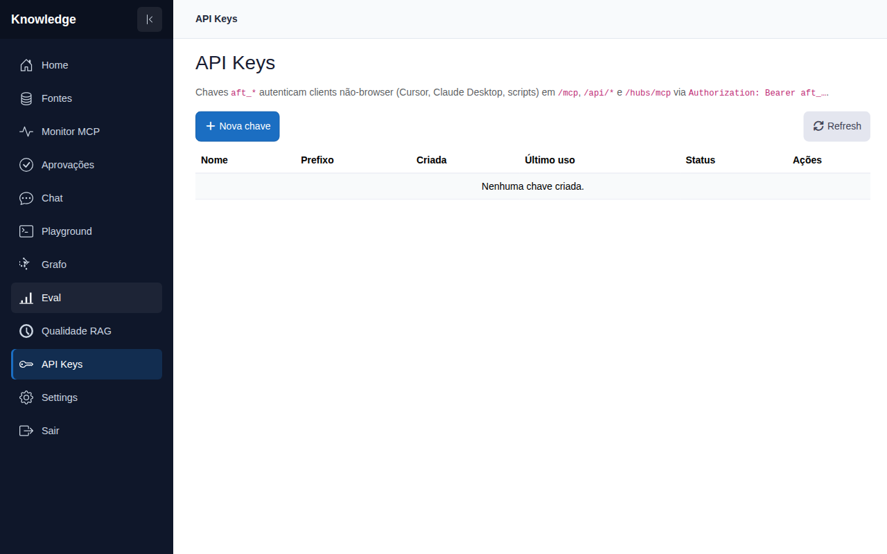

# API keys

**Rota:** `/api-keys`

## Como funciona

`ApiKeys.razor` gerencia as chaves bearer `aft_*` com que clients MCP/A2A se
autenticam:

- **Tabela de chaves** — nome, criada em, último uso, latência média, contagem
  de erros e status; chaves podem ser revogadas sem apagar o histórico de uso.
- **Criar** — o segredo completo aparece **uma única vez** num dialog com
  botão de copiar (um aviso aparece se o clipboard não estiver disponível);
  depois disso só resta a chave mascarada.
- **Config por chave** — cada chave pode sobrescrever os settings globais para
  a própria sessão: endpoint/modelo/chave de chat (o que `set_chat_settings`
  manipula) e chaves de integrações (`set_api_key_settings` — firecrawl,
  deepwiki, tavily, context7). "Voltar pro global" limpa o override.
- **Auditoria de uso** — contagem de chamadas e timestamps de último uso por
  chave alimentam a trilha de auditoria.
