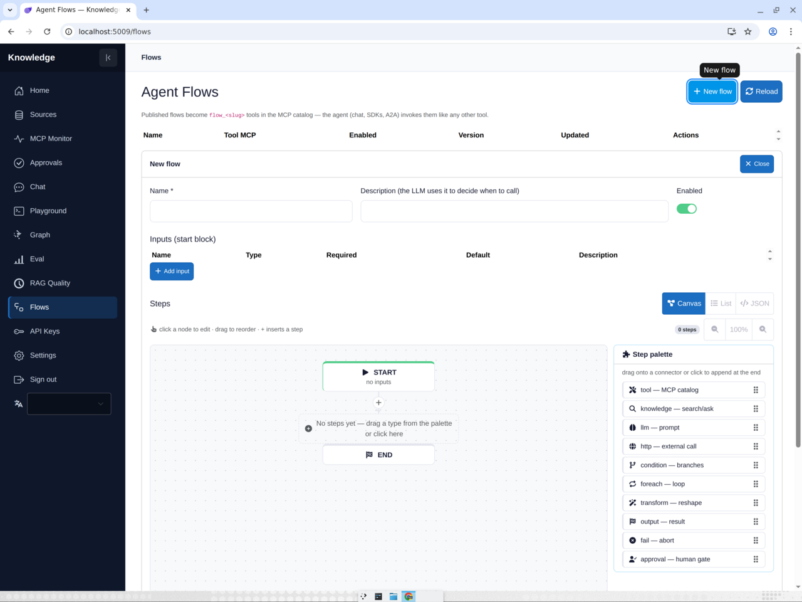
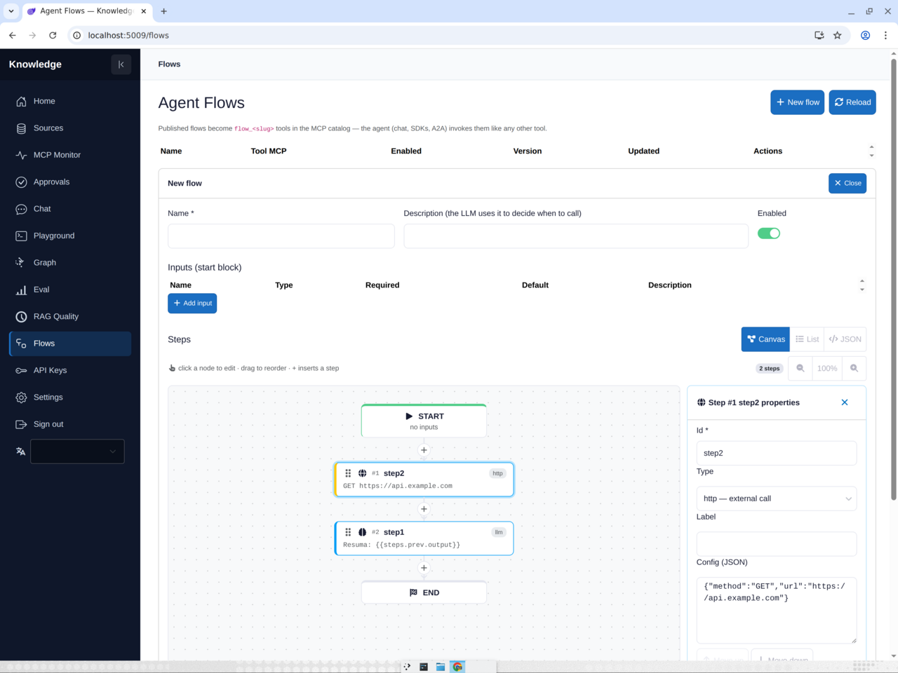

# Flows

**Rota:** `/flows`

## Como funciona

`Flows.razor` gerencia definições de `AgentFlow` — pipelines sequenciais de
steps que viram tools MCP (`flow_<slug>`) e skills A2A.

### Editor (canvas-first)

Abrir Novo/Editar cai direto no workspace **Canvas** — um canvas grande com
grade de pontos (START → steps → END) mais um painel lateral, no padrão
n8n/Node-RED:

- **Paleta** (painel, nada selecionado) — os 10 tipos de step; **arraste** um
  tipo para um conector para inserir naquele ponto, ou **clique** para
  adicionar no fim.
- **Inspector** (painel, nó selecionado) — id, tipo, label e Config JSON do
  step (Nested steps JSON para `foreach`/`condition`), com Mover para cima/
  baixo, **Duplicar** e Remover.
- **Canvas** — badge `#n` de posição e ícone de tipo por nó, `+` em cada
  conector insere step ali, arrastar um nó para outro conector reordena,
  triângulo de alerta quando o JSON do step é inválido, contador de steps e
  zoom (50–150%) na toolbar, e um nó fantasma tracejado em flows vazios.
- As visões **Lista** e **JSON** continuam disponíveis e sincronizadas; o card
  de inputs declara os inputs do flow e há Validar + Salvar.

### Runs & triggers

- **Card de run** — executa um flow salvo com inputs; run com falha retorna
  422, step `approval` suspenso retorna 202 e retoma em
  [/approvals](approvals.md).
- **Runs** — histórico de execuções com status e outputs por step.
- **Triggers** — schedule (intervalo em segundos) ou webhook (tokens `fwt_*`);
  ativar/desativar por trigger, timestamp do último disparo.
